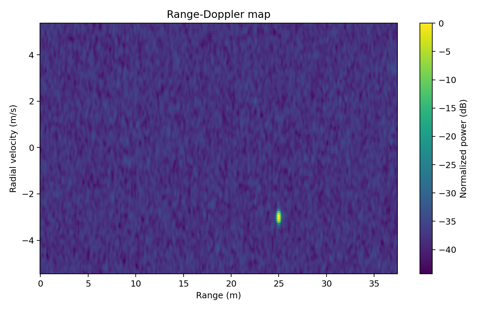
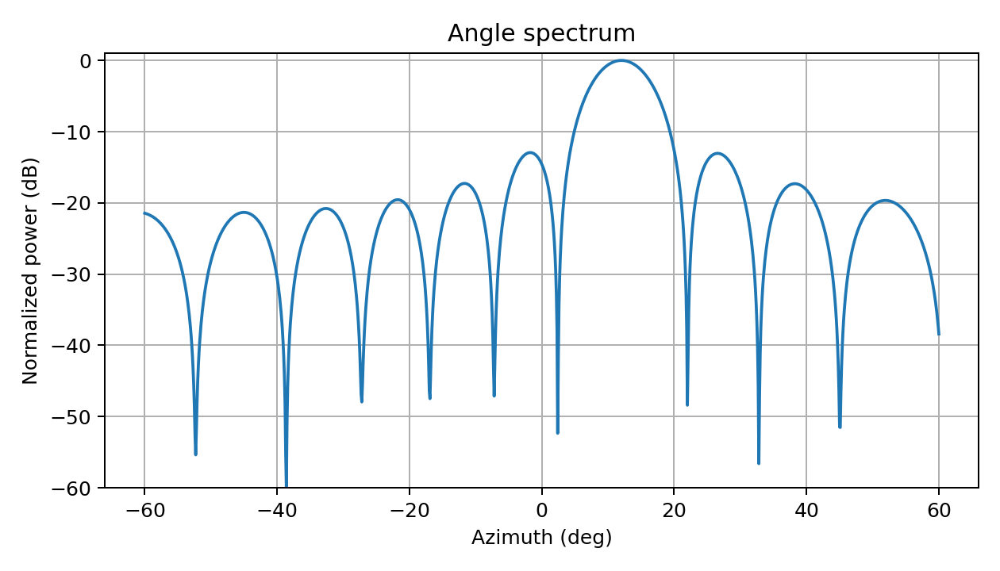

# PyRadarSystems

[](https://www.python.org/) [](LICENSE)

**PyRadarSystems** (`pyradarsystems`) is an open, validation-first Python framework for radar simulation, phased arrays, signal processing, detection, tracking, hardware integration, and reproducible research.

**Version 0.1.0 is the first vertical slice of that roadmap:** a self-contained **77-GHz FMCW TDM-MIMO core** with transparent mathematical models for academic papers, Monte Carlo studies, algorithm development, and later hardware validation.

## Reference outputs

| Range-Doppler processing | Angle estimation |
|---|---|
|  |  |

The reference point-target example recovers a 25 m, -3 m/s, 12° target as approximately 25.03 m, -3.04 m/s, and 12.0°. The included automated test suite contains seven analytical and end-to-end checks.

## What is included

- Configurable FMCW waveform and derived radar limits
- Arbitrary 3D TX/RX element coordinates, ULA/URA helpers, and virtual arrays
- TDM-MIMO point-target echo generation with range, radial velocity, azimuth/elevation, RCS, thermal noise, calibration errors, and optional phase noise
- Labelled `xarray.DataArray` radar cubes with units and provenance metadata
- Range FFT and Doppler FFT with physically labelled axes
- TDM Doppler compensation
- Bartlett, Capon/MVDR, and MUSIC angle estimation
- 1D and 2D CA-CFAR
- Reproducibility manifest and configuration hashing
- Analytical and end-to-end tests
- Three runnable research examples

## Installation

```bash
python -m venv .venv
# Linux/macOS
source .venv/bin/activate
# Windows PowerShell
# .venv\Scripts\Activate.ps1

pip install -e .
# For an offline environment with dependencies already installed:
# pip install -e . --no-build-isolation
```

For development:

```bash
pip install -e ".[dev]"
pytest
```

GitHub Actions runs the test suite on Python 3.10, 3.11, and 3.12 for every push and pull request.

## Run the basic example

```bash
python examples/basic_point_target.py
```

Outputs are written to `results/basic_point_target/` and include the resolved configuration, metadata, numerical estimates, and figures.

Run through the command line:

```bash
pyradar demo --output results/cli_demo
```

## Minimal example

```python
import numpy as np
from pyradarsystems import (
    FMCWWaveform,
    RadarArray,
    RadarSystem,
    PointTarget,
    TDMFMCWSimulator,
    RangeDopplerProcessor,
)

waveform = FMCWWaveform(
    carrier_frequency_hz=77e9,
    bandwidth_hz=1e9,
    chirp_duration_s=50e-6,
    idle_time_s=10e-6,
    sampling_rate_hz=10e6,
    samples_per_chirp=500,
    chirps_per_tx=64,
)

wavelength = waveform.wavelength_m
array = RadarArray.tdm_3tx_4rx(wavelength)
system = RadarSystem(waveform=waveform, array=array, tx_power_w=0.01)

targets = [PointTarget(range_m=25, radial_velocity_mps=-3, azimuth_deg=12, rcs_sqm=10)]
raw = TDMFMCWSimulator(system, seed=7).simulate(targets)
rd = RangeDopplerProcessor().process(raw, waveform)
```

## Data conventions

Raw cube dimensions:

```text
(frame, tx, rx, chirp, sample)
```

Range-Doppler cube dimensions:

```text
(frame, tx, rx, doppler, range)
```

Coordinates are SI units unless explicitly suffixed. Angles are degrees at the public API. Element coordinates are Cartesian `[x, y, z]` in metres, with azimuth measured from broadside toward positive `x` for arrays lying on the `x` axis.

## Planned framework scope

The repository name reflects the complete planned system rather than only the first automotive-radar release. Future modules are organized around:

```text
pyradarsystems/
├── waveforms
├── rf
├── arrays
├── channels
├── targets
├── scenes
├── simulation
├── processing
├── detection
├── estimation
├── tracking
├── hardware
├── visualization
├── experiments
└── validation
```

The current 77-GHz TDM-MIMO implementation is the initial research-ready core, not a limitation on the long-term project scope.

## Model scope and limitations

Version 0.1 uses a far-field point-target baseband/dechirped signal model. It does not yet implement mesh scattering, full electromagnetic propagation, multipath ray tracing, mutual coupling from first principles, atmospheric attenuation, tracking, or hardware capture readers. These are planned modules, not silently approximated features.

## Reproducibility

Every simulator output stores:

- Package version
- Random seed
- Waveform and array configuration
- Target definitions
- Coordinate conventions
- Simulation timestamp
- SHA-256 configuration hash

Use `pyradarsystems.reproducibility.write_manifest(...)` to create a publication-ready manifest.

## License

BSD 3-Clause. See `LICENSE`.


## Repository hygiene

Generated files under `results/`, package builds under `dist/`, virtual environments, and caches are excluded by `.gitignore`. Add the final repository URL to `CITATION.cff` after the GitHub repository is created.
