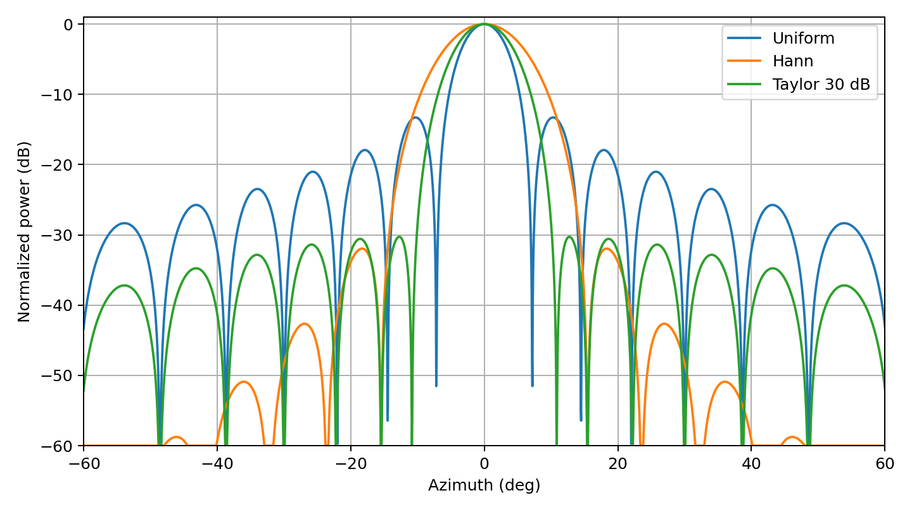

# PyRadarSystems

[](https://www.python.org/) [](LICENSE)

**PyRadarSystems** (`pyradarsystems`) is an open, validation-first Python framework for radar simulation, phased arrays, signal processing, detection, estimation, reproducible experiments, tracking, and hardware integration.

Repository: https://github.com/mohammedfahmed/pyradarsystems

## Current release

**Version 0.2.0** retains the self-contained 77-GHz FMCW TDM-MIMO core and adds the first reproducible-research layer:

- Deterministic serial or process-parallel Monte Carlo studies
- Stable component-specific random streams and CSV seed manifests
- Means, standard deviations, paired differences, and confidence intervals
- Generated CSV, LaTeX, YAML, and JSON result bundles
- Uniform, Hann, Hamming, Blackman, Taylor, and Chebyshev tapers
- Explicit constant-total-power, constant-peak-power, and constant-broadside-gain normalization
- Isotropic, cosine-power, and tabulated measured/simulated element patterns
- Array-pattern HPBW, first-null beamwidth, PSLR, and ISLR
- Transparent distributed angular clutter built from point scatterers
- Basic range and Doppler Cramér-Rao lower bounds
- YAML configuration support for element patterns and taper policies



The release also includes the original waveform, array, point-target, thermal-noise, TDM compensation, range-Doppler, Bartlett, Capon/MVDR, MUSIC, and CA-CFAR functionality.

## Installation

```bash
python -m venv .venv
# Linux/macOS
source .venv/bin/activate
# Windows PowerShell
# .venv\Scripts\Activate.ps1

python -m pip install --upgrade pip
pip install -e ".[dev]"
pytest
```

## Basic radar example

```bash
python examples/basic_point_target.py
```

The reference example estimates a 25 m, -3 m/s, 12° point target and writes labelled radar products and provenance metadata under `results/basic_point_target/`.

## Reproducible taper study

```bash
python examples/reproducible_taper_study.py \
  --trials 200 \
  --workers 1 \
  --output results/reproducible_taper_study
```

Use more workers when the evaluator is importable and picklable:

```bash
python examples/reproducible_taper_study.py --trials 200 --workers 4
```

The study writes:

```text
raw_metrics.csv
summary.csv
summary.tex
seed_manifest.csv
resolved_configuration.yaml
manifest.json
ideal_taper_patterns.pdf
ideal_taper_patterns.png
```

## Minimal taper API

```python
import numpy as np
from pyradarsystems import (
    CosineElementPattern,
    FMCWWaveform,
    RadarArray,
    array_pattern,
    make_taper,
    normalize_taper,
    pattern_metrics,
)

waveform = FMCWWaveform()
array = RadarArray.ula(1, 16, waveform.wavelength_m, rx_spacing_lambda=0.5)
weights, report = normalize_taper(
    make_taper(16, "taylor", sidelobe_level_db=30),
    "constant_total_power",
)
grid = np.linspace(-90, 90, 7201)
power = array_pattern(
    weights,
    array.rx_positions_m,
    waveform.wavelength_m,
    grid,
    element_pattern=CosineElementPattern(exponent=2),
)
metrics = pattern_metrics(power, grid)
print(report)
print(metrics)
```

## Minimal Monte Carlo API

```python
from pyradarsystems import MonteCarloStudy


def evaluate(context):
    noise = context.rng("noise").normal()
    return {"estimate": float(noise)}


study = MonteCarloStudy(
    name="example",
    num_trials=1000,
    master_seed=20260731,
    streams=("noise",),
)
result = study.run(evaluate)
result.write_bundle("results/example")
```

Seed derivation is independent of worker count and execution order. Use the same stream within a trial to construct paired comparisons without silently changing random realizations.

## Data conventions

Raw cube dimensions:

```text
(frame, tx, rx, chirp, sample)
```

Range-Doppler cube dimensions:

```text
(frame, tx, rx, doppler, range)
```

Coordinates use SI units unless explicitly suffixed. Angles are degrees at the public API. Element coordinates are Cartesian `[x, y, z]` in metres. Azimuth is measured from +y broadside toward +x for arrays lying on the x axis.

Element-pattern models return normalized **one-way power gain**. The simulator applies the corresponding square-root voltage factor independently on transmit and receive.

## Validation status

The v0.2 suite contains **18 automated tests**, including analytical range/Doppler behavior, virtual-array recovery, taper normalization, reference ULA sidelobes, element-pattern attenuation, reproducible seeds, result export, distributed-clutter RCS conservation, CRLB trends, and an empirical CA-CFAR false-alarm audit.

See [docs/VALIDATION.md](docs/VALIDATION.md) for completed and planned validation.

## Scope and limitations

The current simulator uses a far-field point-scatterer dechirped baseband model. The distributed-clutter model is a controlled collection of point scatterers; it is not terrain electromagnetic scattering. Version 0.2 does not yet include mesh scattering, multipath ray tracing, atmospheric models, mutual coupling from first principles, hardware ADC readers, tracking, or GPU acceleration.

See [docs/ROADMAP.md](docs/ROADMAP.md) for the planned expansion.

## License and citation

BSD 3-Clause. See [LICENSE](LICENSE) and [CITATION.cff](CITATION.cff).
